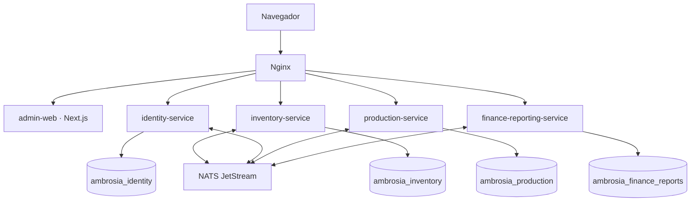

# Arquitectura de Ambrosia

Estado: Fase 1 en progreso; 1A completada. Cuatro microservicios desplegables y detenibles de forma independiente. Identidad es el único dominio funcional incorporado después de la fundación técnica.

Los cuatro nodos de datos residen inicialmente en un servidor PostgreSQL, con usuarios distintos y sin CONNECT público. Cada cuenta posee solamente su base y esquema público. PostgreSQL compartido y NATS son fallos comunes de infraestructura; independencia de aplicaciones no equivale a alta disponibilidad de infraestructura. No hay joins entre bases, transacciones distribuidas ni clientes Prisma compartidos.

`contracts` contiene HealthV1, EventEnvelopeV1 y el contrato versionado de claims/permisos. El mapa rol-permisos, las sesiones, las claves y la persistencia pertenecen exclusivamente a `identity-service`; no se comparten modelos Prisma. `shared-config` contiene únicamente validación técnica. Los adaptadores de infraestructura se mantienen dentro de cada servicio para preservar despliegue y evolución independientes. Su duplicación pequeña es deliberada. El transporte de eventos incluye ID, versión, instante UTC y correlación; no se crean streams de negocio ni consumidores. En fases futuras definir persistencia, retención, deduplicación, consumidores durables e idempotencia antes de emitir eventos.

Identidad emite access tokens RS256 de vida corta y publica solo su clave pública en JWKS. Los refresh tokens son opacos, se guardan mediante SHA-256, rotan en cada uso y mantienen una familia para detectar reutilización. El navegador recibe tokens únicamente mediante cookies: access y refresh son HttpOnly, y el token CSRF legible se enlaza a una cookie HttpOnly firmada. Cada servicio validará los JWT localmente en la Fase 1B usando JWKS, sin consultar la base de identidad ni compartir secretos.

Health es independiente de futuros módulos: proceso vivo versus disponibilidad de PostgreSQL y JetStream. Los timeouts están acotados; la conexión NATS inicial se reintenta y la reconexión posterior es automática. La consulta de readiness verifica JetStream, no solo el socket. El proceso cierra Prisma y drena/cierra NATS al recibir señales.

Nginx usa DNS dinámico, sin dependencias de arranque que acoplen los servicios. Una respuesta inválida del upstream se convierte en 503 JSON. Los logs omiten cuerpos, consultas SQL, credenciales y query strings. No se confía en un ID de correlación arbitrario: solo ASCII limitado a 128 caracteres.

La futura tienda y commerce-service tendrán sus propios ciclos de despliegue, datos y contratos; no existen todavía. HTTP interno se reserva para consultas síncronas, NATS para eventos. Moneda futura COP con Decimal; almacenamiento temporal UTC y presentación colombiana.

Fuentes técnicas: [Next.js standalone](https://nextjs.org/docs/app/api-reference/config/next-config-js/output), [Prisma generator](https://www.prisma.io/docs/orm/v7/prisma-schema/overview/generators), [NATS JetStream](https://docs.nats.io/nats-concepts/jetstream).
