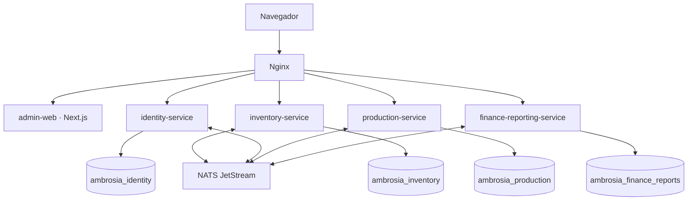

# Arquitectura de Ambrosia

Estado: Fase 1 completada; Fases 2A y 2B incorporan catálogo y proveedores de inventario. Cuatro microservicios desplegables y detenibles de forma independiente. Identidad y catálogo tienen persistencia propia.

```mermaid
flowchart TD
    Browser[Navegador] --> Gateway[Nginx]
    Gateway --> Web[admin-web · Next.js]
    Gateway --> Identity[identity-service]
    Gateway --> Inventory[inventory-service]
    Gateway --> Production[production-service]
    Gateway --> Finance[finance-reporting-service]
    Identity --> ADB[(ambrosia_identity)]
    Inventory --> IDB[(ambrosia_inventory)]
    Production --> PDB[(ambrosia_production)]
    Finance --> FDB[(ambrosia_finance_reports)]
    Inventory <--> NATS[NATS JetStream]
    Identity <--> NATS
    Production <--> NATS
    Finance <--> NATS
```

Los cuatro nodos de datos residen inicialmente en un servidor PostgreSQL, con usuarios distintos y sin CONNECT público. Cada cuenta posee solamente su base y esquema público. PostgreSQL compartido y NATS son fallos comunes de infraestructura; independencia de aplicaciones no equivale a alta disponibilidad de infraestructura. No hay joins entre bases, transacciones distribuidas ni clientes Prisma compartidos.

`contracts` contiene HealthV1, EventEnvelopeV1 y el contrato versionado de claims/permisos. El mapa rol-permisos, las sesiones, las claves y la persistencia pertenecen exclusivamente a `identity-service`; no se comparten modelos Prisma. `shared-config` contiene únicamente validación técnica. Los adaptadores de infraestructura se mantienen dentro de cada servicio para preservar despliegue y evolución independientes. Su duplicación pequeña es deliberada. El transporte de eventos incluye ID, versión, instante UTC y correlación; no se crean streams de negocio ni consumidores. En fases futuras definir persistencia, retención, deduplicación, consumidores durables e idempotencia antes de emitir eventos.

Identidad emite access tokens RS256 de vida corta y publica solo su clave pública en JWKS. Los refresh tokens son opacos, se guardan mediante SHA-256, rotan en cada uso y mantienen una familia para detectar reutilización. El navegador recibe tokens únicamente mediante cookies: access y refresh son HttpOnly, y el token CSRF legible se enlaza a una cookie HttpOnly firmada. Desde Fase 1C, cada servicio de negocio valida los JWT localmente usando JWKS, sin consultar la base de identidad ni compartir secretos.

Health es independiente de futuros módulos: proceso vivo versus disponibilidad de PostgreSQL y JetStream. Los timeouts están acotados; la conexión NATS inicial se reintenta y la reconexión posterior es automática. La consulta de readiness verifica JetStream, no solo el socket. El proceso cierra Prisma y drena/cierra NATS al recibir señales.

Nginx usa DNS dinámico, sin dependencias de arranque que acoplen los servicios. Una respuesta inválida del upstream se convierte en 503 JSON. Los logs omiten cuerpos, consultas SQL, credenciales y query strings. No se confía en un ID de correlación arbitrario: solo ASCII limitado a 128 caracteres.

La futura tienda y commerce-service tendrán sus propios ciclos de despliegue, datos y contratos; no existen todavía. HTTP interno atiende consultas síncronas y, desde Fase 4, la coordinación idempotente descrita en ADR-010. NATS se reserva para eventos futuros. Moneda futura COP con Decimal; almacenamiento temporal UTC y presentación colombiana.

Fuentes técnicas: [Next.js standalone](https://nextjs.org/docs/app/api-reference/config/next-config-js/output), [Prisma generator](https://www.prisma.io/docs/orm/v7/prisma-schema/overview/generators), [NATS JetStream](https://docs.nats.io/nats-concepts/jetstream).

Fase 1B: Next valida cada render protegido con /me mediante una URL privada y solo la cookie access. El cliente renueva por Nginx con CSRF y cookies HttpOnly, sin compartir persistencia ni claves. El binding CSRF solo permite intentar recuperación. Ver [entrega](../delivery.md) para los estados de sesión y reintentos.

## Autenticación distribuida (Fase 1C)

Los tres servicios de negocio incorporan @ambrosia/nest-auth como infraestructura compilada localmente. Esta excepción explícita a compartir solo contratos/configuración no permite compartir dominio ni persistencia. Los guards globales exigen access JWT y permisos; health permanece público. Swagger se protege mediante middleware porque sus handlers no pasan por guards de controladores.

Readiness añade dependencies.jwks: requiere una clave pública vigente o una descarga válida, además de PostgreSQL y JetStream. Liveness sigue comprobando solo el proceso. No hay llamada a Identity en cada petición. El contrato HealthV1 añade jwks opcional para conservar compatibilidad con Identity.

Ver [ADR-006](../adr/ADR-006-distributed-authentication-rbac.md) para la caché, rotación, CSRF, revocación y matriz de permisos. El mapa rol-permisos continúa perteneciendo a Identity; negocio utiliza los permisos del token verificado.

## Catálogo de inventario (Fase 2A)

Category y CatalogItem pertenecen exclusivamente a Inventory y ambrosia_inventory. El panel consume contratos v1 por Nginx, usando la sesión y permisos existentes. Las mutaciones usan versión optimista y transacciones serializables; no hay consultas cruzadas ni eventos sin Outbox. El job inventory-migrate aplica la migración antes del servicio HTTP. Véase [ADR-007](../adr/ADR-007-inventory-catalog.md).

## Proveedores (Fase 2B)

Supplier y SupplierItem amplían Inventory con un directorio y relaciones muchos-a-muchos con CatalogItem. Usan exclusivamente ambrosia_inventory, su cliente Prisma y contratos v1. Las mutaciones atómicas usan expectedVersion y Serializable; las nuevas asociaciones bloquean los artículos mientras comprueban actividad. Ver ADR-008. Los ocho servicios permanentes y el gateway conservan su configuración.

## Compras y existencias (Fase 3)

Inventory incorpora compras, detalles, ledger y saldo materializado dentro de su propia base. La recepción, reversión y ajustes son transacciones serializables; la proyección nunca se actualiza sin su movimiento. No se agregan servicios, accesos cruzados, eventos de negocio ni Outbox. purchases.read/write separa permisos de compras; inventory.read/write conserva inventario. Véase ADR-009 y purchases.md.

## Producción (Fase 4)

Production conserva fórmulas versionadas, lotes y coordinación persistente en su propia base. Inventory confirma consumo/compensación y ledger atómicamente en su base. HTTP técnico autenticado y privado comunica solicitudes idempotentes; recuperación periódica reconcilia respuestas perdidas. No hay atomicidad global, transacciones distribuidas ni acceso cruzado. Ver ADR-010 y production.md.

## Rendimiento y envasado (Fase 5)

Production añade resultados físicos y operaciones de envasado versionadas. Inventory amplía la misma operación técnica idempotente para ingresar granel, consumir granel y empaques, y generar unidades vendibles. Cada presentación es un artículo FINISHED_PRODUCT por unidad; los materiales son PACKAGING. Todos los movimientos de un envasado comparten UUID y transacción Serializable local. Ver ADR-011.

## Finanzas (Fase 6)

Finance controla cuentas, ledger monetario, pagos y ventas en ambrosia_finance_reports. Inventory expone por HTTP interno una instantánea de compra y operaciones idempotentes de salida/retorno de venta; no comparte tablas ni Prisma. Finance persiste el UUID y estado pendiente antes del llamado, confirma dinero después del resultado y recupera con el mismo UUID. La credencial Finance–Inventory es independiente y el gateway bloquea rutas internas. Ver ADR-012.

## Costeo e informes (Fase 7)

Inventory amplía su mismo ledger con valor, costo unitario y promedio ponderado móvil; las existencias históricas positivas requieren valoración inicial explícita. Production recibe y conserva instantáneas no autoritativas del costo real de lote, granel y envasado. Finance recibe COGS confirmado por Inventory y deriva margen bruto. No se agregan bases, servicios, eventos, transacciones distribuidas ni accesos cruzados. Ver ADR-013.

## Infraestructura de Reporting (Fase 8A)

'finance-reporting-service' mantiene separados los módulos Finance y Reporting dentro de la misma aplicación y base propia. Inventory, Production y Finance publican snapshots v1 repetibles en JetStream; el consumidor durable materializa artículos, movimientos, lotes y márgenes con deduplicación por 'eventId' y orden determinista por versión e instante.

Reporting es derivado y eventualmente consistente. No escribe dominios operativos ni consulta bases ajenas. Inventory ofrece una API interna paginada, autenticada y no publicada por el gateway para reconciliar o reconstruir sus proyecciones. La API de usuario expone listas paginadas bajo '/api/v1/reports'; los rangos son UTC y semiabiertos '[from, to)'. 'reports.finance' separa información financiera, 'reports.manage' protege las operaciones administrativas y 'reports.export' queda reservado para exportaciones futuras. Ver ADR-014.

## Reportes operativos (Fase 8B)

Reporting añade proyecciones por línea de compra y operación de envasado. Inventory publica y reconcilia catálogo, Kardex y compras desde su propia base; Production publica y reconcilia lotes y envasado desde la suya mediante una credencial técnica separada. La API calcula KPIs y comparación temporal con Decimal, pagina las listas y aplica reports.finance en el servidor. El panel /reportes ofrece nueve destinos responsive. Ver reporting.md.
